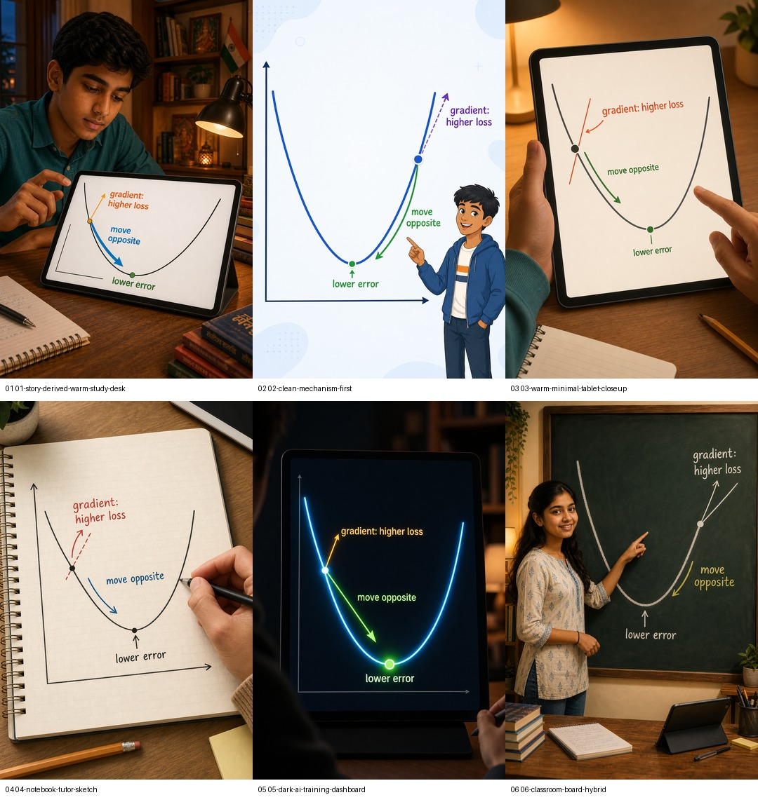

# Video Style Experiment Log

Purpose: preserve the visual style experiments used to decide the video-first source-frame direction for the "How AI Uses Math" lessons.

This is an evidence log, not a final brand guide. Final hard rules should move into `VIDEO_FIRST_VISUAL_GUIDE.md` only after repeated success across lessons and Runway clips.

## Current Decision

Status: provisional recommendation.

- Use **Warm Minimal Tablet Closeup** as the default candidate style for video-first math/AI lessons.
- Keep the richer story-card style for image-only lessons, where each card must explain itself without voiceover.
- Use **Clean Mechanism First** as a fallback for technically dense graph/vector/matrix moments where clarity beats character continuity.
- Use **Notebook Tutor Sketch** as an occasional school-math insert style, not the whole visual identity.
- Use **Dark AI Dashboard** selectively for model-training/system moments, not as the default series look.
- Repair vector prompts before full regeneration in the Warm Minimal style; the current vector frames need stronger distance/nearest-neighbor cues.

Do not regenerate all existing lessons yet. First regenerate full video-first source frames for Gradient Descent and Statistics in Warm Minimal style, run selected Runway clips, and compare motion/readability.

## Experiment 1: Runway A/B Smoke Test

Question: for a hard technical frame, does a story-derived source frame or clean mechanism-first source frame survive Runway better?

Lesson/frame:

- Gradient Descent, frame 4: gradient direction versus opposite update.

Inputs:

- Story-derived source image: `assets/images/gold-candidates/gradient-descent-scene-gated-full-v3/04-slope-gives-direction.png`
- Clean mechanism-first source image: `assets/images/gold-candidates/gradient-descent-runway-smoke-source-v2/04-gradient-direction.png`
- Manifest: `outputs/video-manifests/gradient-descent-runway-style-ab-frame4-v1.json`

Outputs:

- Story clip: `outputs/runway-clips/gradient-descent-runway-style-ab-frame4-v1/story-04-gradient-direction.mp4`
- Clean clip: `outputs/runway-clips/gradient-descent-runway-style-ab-frame4-v1/clean-04-gradient-direction.mp4`
- Story verification sheet: `outputs/runway-clips/gradient-descent-runway-style-ab-frame4-v1/verification/story-04-gradient-direction.contact-sheet.jpg`
- Clean verification sheet: `outputs/runway-clips/gradient-descent-runway-style-ab-frame4-v1/verification/clean-04-gradient-direction.contact-sheet.jpg`

Observed:

- Story-derived clip preserved the rich learner/desk world and text surprisingly well, but added more face/environment motion that competes with the graph.
- Clean mechanism-first clip stayed calmer, had lower frame-diff, almost no black border, and kept attention on the technical mechanism.
- This made the clean/mechanism direction worth testing as a first-class video grammar, not merely as a failed story-card variant.

Decision from this experiment:

- Keep both modes for comparison.
- Run small Runway tests on hardest technical frames before committing a full lesson.

## Experiment 2: Single-Frame Style Grid

Question: beyond the two Runway styles, which source-frame visual style best matches the product vision?

Controlled frame:

- Gradient Descent frame 4.
- Same learning job in all variants: local slope gives a direction clue; the update moves opposite toward lower error.

Prompt pack:

- `assets/image-prompts/gradient-descent-frame4-style-grid.md`

Output folder:

- `assets/images/experiments/gradient-descent-frame4-style-grid-v1/`

Proof:

QA:

- QA note: `assets/images/experiments/gradient-descent-frame4-style-grid-v1/gradient-descent-frame4-style-grid-v1-qa.md`
- QA status: `pass-with-caveats`
- QA next action: `accept`
- QA OpenAI request ID: `a20a330b-23c4-4daa-a919-01bdaf0204f8`
- Image generation LangSmith trace: `019f32e9-3f3a-7d70-bf84-07e07d82c71f`

Styles tested:

1. Story Derived Warm Study Desk
2. Clean Mechanism First
3. Warm Minimal Tablet Closeup
4. Notebook Tutor Sketch
5. Dark AI Training Dashboard
6. Classroom Board Hybrid

Observed:

- Frame 3, Warm Minimal Tablet Closeup, was the best balance of warmth, brand fit, graph readability, and motion safety.
- Frame 2, Clean Mechanism First, was the clearest teaching diagram but risked feeling generic or slide-like.
- Frame 5, Dark AI Training Dashboard, had excellent contrast and motion potential, but may not fit every school-math lesson.
- Frame 4, Notebook Tutor Sketch, was very teachable and approachable, but less connected to the AI/product world.
- Frames 1 and 6 needed readability/composition repair.

Decision from this experiment:

- Warm Minimal Tablet Closeup became the provisional default candidate for video-first source frames.
- Clean Mechanism First remains the technical-clarity fallback.

## Experiment 3: Cross-Lesson Warm Minimal Keyframes

Question: does Warm Minimal Tablet Closeup still work across multiple lesson types, or only for Gradient Descent?

Lessons tested:

- Gradient Descent: graph optimization and repeated updates.
- Statistics: many examples, data points, trend estimate.
- Vectors: meaning as numbers and nearest meanings.

Prompt pack:

- `assets/image-prompts/warm-minimal-tablet-keyframe-comparison-v1.md`

Output folder:

- `assets/images/experiments/warm-minimal-tablet-keyframe-comparison-v1/`

Proof:

Warm Minimal only:

Current style versus Warm Minimal:

QA:

- QA note: `assets/images/experiments/warm-minimal-tablet-keyframe-comparison-v1/warm-minimal-tablet-keyframe-comparison-v1-qa.md`
- QA status: `pass-with-caveats`
- QA next action: `accept`
- QA OpenAI request ID: `62aaaf4d-d89b-42f9-974f-3d82397e4de5`
- Image generation LangSmith trace: `019f3316-5c4a-7d83-81eb-a23699daa22e`

Observed:

- Warm Minimal style was coherent across all three lessons.
- Tablet stayed dominant, which helps video-first motion and mobile readability.
- Gradient Descent and Statistics improved as video source frames because the mechanism moved to the foreground.
- Vectors remained partially weak: the style looked good, but the technical comparison needed clearer distance/nearest-neighbor evidence.
- Some dark-tablet frames had strong contrast but may need label-size and phone-readability checks before animation.

Decision from this experiment:

- Use Warm Minimal as the next full video-first regeneration candidate for Gradient Descent and Statistics.
- Do not use the current Warm Minimal vector frames as final; repair the vector prompt with explicit distance rings, nearest-neighbor radius, or angle/distance cues.

## Experiment 4: Full Gradient Descent Warm Minimal Pass

Question: does Warm Minimal Tablet Closeup work across the full Gradient Descent video-first sequence, and do the highest-risk frames survive Runway?

Inputs:

- Source module: `modules/visual-ai-concepts/gradient-descent-how-ai-learns-from-mistakes.source.md`
- Prompt pack: `assets/image-prompts/gradient-descent-how-ai-learns-from-mistakes-video-first.md`
- Source frame folder: `assets/images/gradient-descent-how-ai-learns-from-mistakes-video-first-warm-minimal-v1/`
- Source contact sheet: `assets/images/gradient-descent-how-ai-learns-from-mistakes-video-first-warm-minimal-v1/gradient-descent-warm-minimal-source-contact-sheet.jpg`
- Runway manifest: `outputs/video-manifests/gradient-descent-warm-minimal-runway-smoke-v1.json`
- Runway clips: `outputs/runway-clips/gradient-descent-warm-minimal-runway-smoke-v1/`

Trace / request IDs:

- Full source-frame generation LangSmith trace: `019f3336-8a7d-7523-8684-4d7e8e60424f`
- Targeted frames 5-6 repair LangSmith trace: `019f333b-ce2d-74f0-a0ef-8086b81aa445`
- Final source-frame QA OpenAI request ID: `5111c65a-8262-43f5-aa0a-511f4efb038a`

QA:

- Source-frame QA note: `assets/images/gradient-descent-how-ai-learns-from-mistakes-video-first-warm-minimal-v1/gradient-descent-warm-minimal-source-frame-review-notes.md`
- Source-frame QA status: `pass-with-caveats`
- Source-frame QA next action: `accept`
- Runway smoke QA note: `outputs/runway-clips/gradient-descent-warm-minimal-runway-smoke-v1/gradient-descent-warm-minimal-runway-smoke-v1-qa.md`
- Runway smoke QA status: `pass-with-caveats`

Observed:

- The full 8-frame source set keeps the Warm Minimal tablet style coherent while still showing the technical mechanism.
- Frames 5 and 6 needed prompt tightening after first QA; targeted regeneration fixed the weak update arrow and partial-improvement gap.
- Runway preserved frame 4's gradient-versus-opposite-update relationship and frame 8's small-step-versus-overshoot comparison.
- The first frame-5 Runway prompt over-animated the point around the curve. The locked-arrow variant worked better: keep old/new points fixed and pulse only the short update arrow.

Decision from this experiment:

- Warm Minimal Tablet Closeup is proven enough for Gradient Descent video-first production.
- For small graph updates, prefer locked, local motion prompts over asking Runway to move a point.
- Repeat the full Warm Minimal source-frame pass for Statistics before promoting Warm Minimal from provisional default to stronger series rule.

## Working Rubric

Use this rubric when selecting a video-first visual style:

| Criterion | Weight | Question |
|---|---:|---|
| Technical clarity | 30 | Does the frame visibly show the mechanism, not just labels? |
| Mobile readability | 20 | Are labels/icons readable after compression and motion? |
| Human warmth / brand fit | 15 | Does it feel like the Indian student/tablet learning world? |
| Motion friendliness | 15 | Is there one clear motion target for Runway? |
| Consistency across lesson | 10 | Can the style hold across 6-8 frames without drift? |
| Cost / regeneration risk | 10 | Is the prompt controllable enough to avoid repeated retries? |

## Current Style Roles

| Style | Best use | Risk |
|---|---|---|
| Rich story-card style | Image-only stories and self-contained static cards | Too dense for image-to-video; Runway may animate the wrong thing |
| Warm Minimal Tablet Closeup | Default video-first candidate for math/AI concepts | Can become too sparse unless the scene plan and voiceover carry the computation |
| Clean Mechanism First | Hard diagrams where graph clarity matters most | Can look generic or slide-like |
| Notebook Tutor Sketch | School-math explanation inserts | Less AI/product feel if overused |
| Dark AI Dashboard | Model-training/system moments | Can become too dark or dashboard-generic |
| Classroom Board Hybrid | Occasional tutoring/classroom moments | Composition/cropping risk; can feel slower |

## Next Steps

1. Regenerate the full Statistics video-first source-frame pack in Warm Minimal Tablet Closeup.
2. Use Gradient Descent's locked-arrow Runway prompt pattern for future small-update graph clips.
3. Repair Vectors prompts before full regeneration:
   - show distance/nearest-neighbor rings,
   - make phone-related result icons unambiguous,
   - preserve the speech-bubble-to-number-chips transformation.
4. Run Runway smoke clips for the hardest frames before full assembly.
5. Keep image-only story cards in the richer self-contained style unless a separate image-only experiment proves Warm Minimal works better there.
