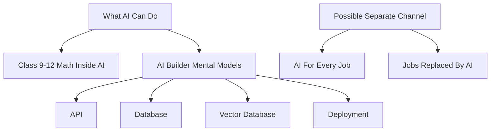

# Idea Inbox And Knowledge Graph System

This document defines how to capture topic ideas, playlist ideas, channel ideas, and emerging themes without forcing them too early into one YouTube channel.

## Core Problem

Many useful ideas arrive before their final home is clear.

Examples:

- how each job role can leverage AI
- which jobs may be replaced and why
- concepts needed to build modern applications
- front-end, back-end, API, deployment, server, container, cloud, database, vector database
- AI tools by profession
- AI builder vocabulary
- future careers
- school concepts inside AI

If every idea is immediately forced into the current YouTube channel, the channel can become scattered.

If ideas are not captured, they are lost.

So the system needs two modes:

```text
capture freely
commit carefully
```

## Principle

The idea inbox should not ask:

```text
Does this belong to the current channel?
```

first.

It should ask:

```text
What is the idea, who is it for, and what larger theme might it belong to?
```

Channel fit can be decided later.

## Recommended Structure

Create a new top-level folder:

```text
knowledge/
```

Purpose:

```text
Capture and organize reusable knowledge before it becomes a channel, playlist, article, video, course, or product.
```

Recommended structure:

```text
knowledge/
  README.md
  inbox/
  themes/
  channels/
  concepts/
  maps/
  decisions/
```

## Folder Roles

### `knowledge/inbox/`

Fast capture.

Use when:

- the idea is fresh
- the final home is unclear
- you only have a rough theme
- you want to preserve examples, questions, or intuition

Example files:

```text
knowledge/inbox/2026-07-02-ai-by-job-role.md
knowledge/inbox/2026-07-02-builder-terms-front-end-api-cloud.md
knowledge/inbox/2026-07-02-jobs-replaced-by-ai.md
```

### `knowledge/themes/`

Theme-level clusters.

Use when multiple ideas point to a durable knowledge area.

Example themes:

```text
knowledge/themes/ai-for-every-job/
knowledge/themes/jobs-and-ai-replacement/
knowledge/themes/modern-builder-vocabulary/
knowledge/themes/class-9-12-math-inside-ai/
knowledge/themes/ai-builder-mental-models/
knowledge/themes/ai-careers-and-work/
```

### `knowledge/channels/`

Potential channel or brand directions.

Use when a theme may become:

- current channel playlist
- second channel
- separate brand
- course/product
- newsletter

Example:

```text
knowledge/channels/what-ai-can-do.md
knowledge/channels/possible-second-channel-builder-basics.md
knowledge/channels/possible-careers-channel.md
```

### `knowledge/concepts/`

Reusable concept explanations that can appear in multiple themes.

Example concepts:

```text
knowledge/concepts/api.md
knowledge/concepts/frontend.md
knowledge/concepts/backend.md
knowledge/concepts/database.md
knowledge/concepts/vector-database.md
knowledge/concepts/container.md
knowledge/concepts/deployment.md
knowledge/concepts/automation.md
knowledge/concepts/agent.md
```

These are not necessarily final content pieces. They are knowledge atoms.

### `knowledge/maps/`

Visual or structural maps.

Use for:

- topic graph
- playlist map
- learner journey
- concept dependency tree
- role-to-AI-use matrix

Example:

```text
knowledge/maps/modern-ai-builder-map.md
knowledge/maps/ai-by-job-role-map.md
knowledge/maps/channel-fit-map.md
```

### `knowledge/decisions/`

Routing decisions and strategic notes.

Example:

```text
knowledge/decisions/2026-07-02-keep-class-9-12-math-as-first-channel-wedge.md
knowledge/decisions/2026-07-02-builder-vocabulary-waits-until-phase-3.md
```

## Capture Template

Every inbox idea should use this lightweight template.

```md
# Idea: <title>

Date captured:
Status: inbox

## Raw Idea

Write the idea without over-organizing it.

## Why It Feels Important

What real-world confusion, opportunity, or curiosity does this address?

## Possible Audience

- students
- parents
- teachers
- working professionals
- job seekers
- creators
- builders
- business owners

## Possible Theme

Examples:

- AI for every job
- jobs and AI replacement
- modern builder vocabulary
- AI builder mental models
- Class 9-12 math inside AI
- careers in the AI era

## Possible Outputs

- YouTube Short
- long-form video
- image story
- article
- community post
- course module
- workshop
- interactive map

## Channel Fit

Current guess:

```text
fits current channel / maybe later / separate channel / not sure
```

Reason:

## Related Concepts

- API
- database
- automation
- vector database
- role impact

## Next Action

One small next step.
```

## Theme Template

Each theme should have a home file:

```md
# Theme: Modern Builder Vocabulary

Status: exploring

## One-Line Promise

Explain the concepts people need to understand in order to build modern AI/software applications.

## Audience

Curious beginners, non-CS learners, early builders, creators, professionals moving into AI.

## Why This Matters

People hear terms like API, cloud, database, deployment, vector database, container, and server, but do not have a mental model for how they fit together.

## Possible Playlists

- What Is An API?
- Frontend, Backend, Database
- Cloud And Deployment
- AI App Building Blocks
- Vector Databases And RAG

## Channel Fit

Could fit `What AI Can Do` later under AI builder literacy.

Should not distract from the first Class 9-12 math wedge during launch.

## Candidate Topics

| Topic | Audience | Output | Status |
|---|---|---|---|
| What is an API? | beginner builders | Short/article | captured |
| Frontend vs backend | students/builders | Short/image story | captured |
```

## Channel Fit Rules

Use these categories:

### Fits Current Channel Now

The idea supports:

```text
Class 9-12 math -> AI mechanism -> memory anchor
```

Example:

- vectors and embeddings
- probability and confidence
- statistics and model learning

### Fits Current Channel Later

The idea supports future expansion into AI literacy or builder mental models.

Example:

- API
- vector database
- RAG
- AI agents
- evaluation
- deployment

### Possible Separate Channel

The idea is strong but has a different audience or promise.

Example:

- job replacement analysis
- AI for every profession
- career strategy
- software builder fundamentals

### Parking Lot

The idea is useful but not aligned with current production.

Example:

- broad AI news
- tool comparisons
- very specific career advice
- opinion pieces without a teaching mechanism

## Example Theme Buckets

### Current Channel Phase 1

```text
Class 9-12 Math Inside AI
```

Topics:

- matrices
- vectors
- functions
- probability
- statistics
- linear equations
- derivatives
- graphs

### Current Channel Phase 3 Candidate

```text
Modern AI Builder Vocabulary
```

Topics:

- frontend
- backend
- API
- server
- database
- cloud
- deployment
- container
- vector database
- RAG
- agents

Why it may fit later:

The channel can evolve from "math inside AI" to "familiar concepts behind AI systems."

Why it should wait:

It could dilute the first channel wedge if introduced too early.

### Possible Separate Theme Or Channel

```text
AI For Every Job
```

Topics:

- how teachers use AI
- how accountants use AI
- how doctors use AI
- how designers use AI
- how small businesses use AI
- current AI readiness by role

Possible promise:

```text
How every profession changes when AI becomes a coworker.
```

### Possible Separate Theme Or Channel

```text
Jobs Replaced By AI
```

Topics:

- what tasks get automated first
- why some jobs are exposed
- why some jobs are resilient
- task replacement vs job replacement
- human judgment, trust, regulation, physical work

Possible promise:

```text
Not hype. A task-by-task look at how AI changes work.
```

This may be too career/economy-focused for the first channel phase.

## Routing Workflow

Use this monthly:

1. Capture freely in `knowledge/inbox/`.
2. Once a week, move related ideas into `knowledge/themes/`.
3. Once a month, review themes against current channel strategy.
4. Promote only a few ideas into `concepts/` production.
5. Keep the rest as structured knowledge, not active commitments.

## Promotion Rule

An idea can move from `knowledge/` to `concepts/` only when it has:

- clear audience
- clear learning promise
- clear output format
- clear channel or distribution fit
- reason to produce now

This prevents the pipeline from becoming overloaded.

## Visualizing The Knowledge

Eventually, use maps like:

```text
knowledge/maps/channel-fit-map.md
knowledge/maps/modern-ai-builder-map.md
knowledge/maps/ai-by-job-role-map.md
```

Possible map formats:

- Markdown tables
- Mermaid diagrams
- dependency trees
- role-to-AI-use matrices
- concept graph

Example:



## Recommended Immediate Action

Create:

```text
knowledge/inbox/
knowledge/themes/
knowledge/channels/
knowledge/concepts/
knowledge/maps/
knowledge/decisions/
```

Then capture the three example idea clusters:

1. AI for every job
2. Jobs replaced by AI
3. Modern builder vocabulary

Do not decide their final channel yet.

## Bottom Line

The system should let you think expansively without making the current YouTube channel chaotic.

Use:

```text
knowledge/ = capture and organize possibilities
concepts/ = committed production candidates
channel/ = YouTube publishing plan
```

That gives you freedom to explore and discipline to publish.
